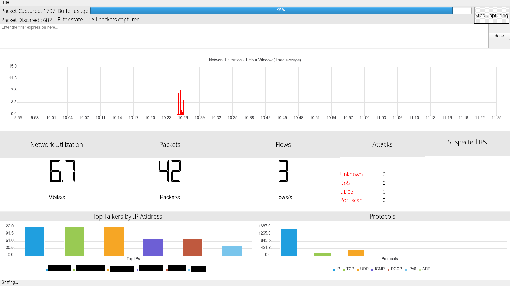

# Intrusion-Detection-using-machine-learning-techniques
This is application is simplified intrusion detection system which using machine
learning techniques to detect malicious network traffic. It captures real-time network
traffic data, then it generates flows from this data. Training machine learning model
using flows rather than raw packet data greatly improves the accuracy. In addition to
that, it uses individual models for DoS, DDoS and port scan attacks. It also have one
model to detect abnormal traffic. This approach enables application to detect DoS,
DDoS and Port Scan with high accuracy and one extra model ensures that IDS also
detects unknown attacks. It also have minimal GUI displaying necessary information
to the user.

